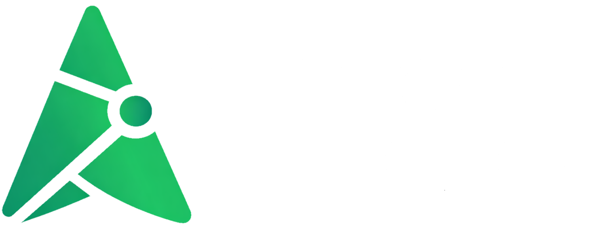

<p align="center">
    
</p>

# Atlas

Atlas er et AI-assistert geospatialt arbeidsverktøy for kartanalyse og KU-relaterte arbeidsflyter. Løsningen kombinerer et interaktivt kart, autentisert chat, MCP-basert verktøyorkestrering og eksportklare geodata i én samlet applikasjon.

Applikasjonen er bygget rundt en enkel idé: Hjelpe saksbehandlere med KU-analyser. Applikasjonen benytter dokumentbasert kontekst, hvor en AI-assistent kan slå opp data, lese innhold, og benytte MCP-verktøy for å utføre romlige analyser, samt levere resultater.

<br>

## Hva Applikasjonen Gjør

- Tilbyr et nettleserbasert kartarbeidsområde sentrert på Norge med valgbare bakgrunnskart.
- Støtter autentiserte chatsesjoner med vedvarende samtalehistorikk.
- Lar AI-assistenten bruke MCP-verktøy for databaseoppslag, geografiske søk, vektorprosessering, dokumenthenting og tegning i kart.
- Lar brukere tegne, redigere, skjule, fjerne og eksportere kartlag.
- Eksporterer valgte lag som GeoJSON, JSON, PNG eller PDF-kartskisser.

## Arkitektur

| Lag | Ansvar | Hovedteknologi |
| --- | --- | --- |
| Frontend | Kartgrensesnitt, chatgrensesnitt, laghåndtering og eksport | React 19, Vite 7, Leaflet, React-Leaflet |
| Backend API | Autentisering, chatlagring, Copilot-orkestrering, REST-endepunkter og montering av MCP-tjenere | Starlette, Uvicorn |
| AI-orkestrering | Sesjonslivssyklus og MCP-verktøytilgang for assistenten | GitHub Copilot SDK |
| MCP-verktøytjenere | Database-, geo-, dokument-, vektor- og kartoperasjoner | FastMCP |
| Datalag | Brukere, sesjoner, chatter, meldinger, romlige/faglige data | PostgreSQL, PostGIS, psycopg |
| Dokumentkilde | PDF-oversikt og tekstuttrekk for assistentkontekst | Azure Blob Storage, PyMuPDF |

### Kjøreflyt

1. Frontend sender autentiserte chat- og kartkontekstforespørsler til backend.
2. Backend gjenoppretter eller oppretter en aktiv Copilot-sesjon for den aktuelle chatten.
3. Assistenten kan kalle MCP-tjenere som ligger i `backend/mcp_servers/` og eksponeres under `/mcp/.../mcp`.
4. Verktøyresultater blir omgjort til chatsvar og, når relevant, kartlag som returneres til grensesnittet.
5. Chatter og meldinger lagres i PostgreSQL for kontinuitet på tvers av sesjoner.

## Nøkkelfunksjoner

- Interaktivt kart med bakgrunnskart fra Kartverket og bildelag fra Esri.
- Tegne- og redigeringsverktøy bygget på Leaflet-Geoman.
- Chathistorikk med oppretting, gjenopptakelse og sletting av samtaler.
- Sikker autentisering med bcrypt-hashede passord og hashede sesjonstokens.
- Romlige verktøy for buffer, snitt, envelope, punkt-i-polygon og domenespesifikke søk.
- PDF-henting fra Azure Blob for dokumentbevisste assistentsvar.
- Eksportpipeline i nettleseren for både rå geodata og visuelt utformet kartoutput.

## Repositorystruktur

| Sti | Formål |
| --- | --- |
| `src/` | React-applikasjon, kartgrensesnitt, chatgrensesnitt, eksport og klientverktøy |
| `backend/` | Starlette-server, autentisering, databasetilgang, sesjonshåndtering, konfigurasjon og montering av MCP-tjenere |
| `backend/mcp_servers/` | Den aktive katalogen for MCP-tjenere som brukes av applikasjonen |
| `backend/agent_tool_catalog.py` | Normalisert verktøykatalog for SDK-agenter, inkludert MCP-verktøy, databackede kapabiliteter, risikoer og ekskluderte interne flater |
| `public/` | Grafiske profileringsressurser brukt av frontend |

## MCP-Tjenere I Bruk

| Tjener | Formål |
| --- | --- |
| `db_server` | Skjemaoversikt og skrivebeskyttet SQL-tilgang |
| `geo_server` | Oppslag av kommuner, vernetyper og buffersøk i geodata |
| `docs_server` | PDF-listing og tekstuttrekk fra Azure Blob Storage |
| `vector_server` | GeoJSON-baserte romlige operasjoner og domenespesifikk geometriuthenting |
| `map_server` | Sender GeoJSON-resultater tilbake til frontend som tegnbare lag |
| `search_server` | Dokumentsøk med fulltekst, fuzzy, semantisk og hybrid søk, samt status og indeksoppdatering |

## Teknologistack

| Område | Stack |
| --- | --- |
| Frontend | React, React Router, Vite, Font Awesome, Lucide, React Markdown |
| Kart | Leaflet, React-Leaflet, Leaflet-Geoman |
| Backend | Python 3.12, Starlette, Uvicorn, python-dotenv |
| AI / MCP | GitHub Copilot SDK, FastMCP |
| Data | PostgreSQL, PostGIS, psycopg, psycopg-pool |
| Dokumenter | Azure Storage Blob, PyMuPDF |

## Oppsett Og Oppstart

### Forutsetninger

- Node.js 20+
- Python 3.12+
- En PostgreSQL/PostGIS-database tilgjengelig for backend
- Nødvendige applikasjonsskjemaer og data i PostgreSQL, inkludert `app` for autentisering/chatdata og GIS-datasettene MCP-verktøyene spør mot
- En Azure Blob-container med PDF-dokumenter dersom dokumenthenting er en del av miljøet

### 1. Installer avhengigheter

```powershell
npm install
python -m venv .venv
.venv\Scripts\Activate.ps1
pip install -r backend\requirements.txt
```

### 2. Konfigurer backend

1. Kopier `backend\config.example.py` til `backend\config.py`.
2. Opprett lokal backend-konfigurasjon for miljøvariabler basert på eksempelfilen i `backend`-mappen.
3. Fyll inn nødvendige verdier før serveren startes.

Backend forventer som minimum konfigurasjon for:

- `DATABASE_URL`
- `ALLOWED_ORIGINS`
- `MODEL_NAME`
- `AZURE_CONNECTION_STRING`
- `BLOB_CONTAINER_NAME`
- `SYSTEM_PROMPT`
- `SERVER_BASE_URL` når backend ikke kjører på lokale standardverdier
- Valgfrie justeringer som sesjonsgrenser, buffergrenser og `DEMO_MODE`

Vite-devserveren er allerede konfigurert til å proxye `/api`-forespørsler til `http://127.0.0.1:8000`.

### 3. Start applikasjonen

Start backend:

```powershell
cd backend
uvicorn server:app --reload --host 0.0.0.0 --port 8000
```

Eller:
```powershell
cd backend
python server.py
```

Start frontend i et nytt terminalvindu fra roten av repoet:

```powershell
npm run dev
```

Åpne `http://localhost:5173`.

## API-Flate

| Type | Flate |
| --- | --- |
| REST | `/api/auth/*`, `/api/chats`, `/api/chat`, `/api/documents` |
| MCP | `/mcp/db/mcp`, `/mcp/geo/mcp`, `/mcp/docs/mcp`, `/mcp/vector/mcp`, `/mcp/map/mcp`, `/mcp/search/mcp` |

## Operasjonelle Notater

- Chathistorikk lagres i PostgreSQL, mens aktive AI-sesjoner holdes i minnet og ryddes bort ved inaktivitet.
- Frontend lagrer autentiseringsstatus og aktiv chat-ID i nettleserens `localStorage` for å bevare sesjonen.
- Eksport genereres på klientsiden, inkludert opprettelse av PNG- og PDF-kartskisser.
- Den nåværende Vite-proxyen dekker `/api`; MCP-trafikk håndteres internt av den samme backendtjenesten.
- Applikasjonen bruker MCP-implementasjonene i `backend/mcp_servers/`.
