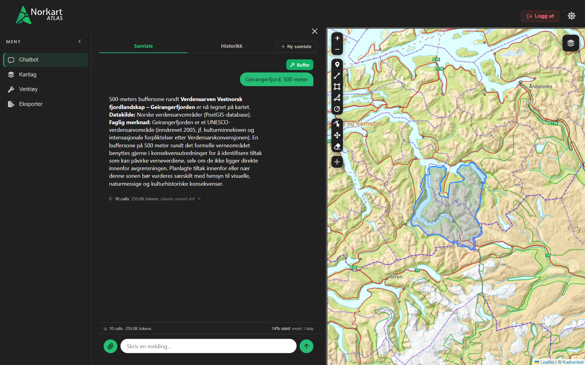

  
  
<em>AI-assistert geospatialt arbeidsverktøy for kartanalyse og KU-relaterte arbeidsflyter</em>

---

## Oversikt

Atlas er en GeoMCP-chatbot utviklet for å assistere saksbehandlere i arbeid med norske konsekvensutredninger (KU). Assistenten kombinerer et interaktivt kart, dokumentbasert kontekst og romlige analyser i ett grensesnitt – og lar brukere stille faglige spørsmål, hente geodata og eksportere kartlag uten å forlate arbeidsflaten.

---

## Mørk og lys modus

Atlas støtter mørk og lys modus med persistent lagring i nettleseren.

---

## Interaktivt kart

Kartarbeidsområdet er sentrert på Norge med bakgrunnskart fra Kartverket og flyfoto fra Esri.
Brukere kan bytte mellom bakgrunnskart i sanntid.

---

## Tegning og redigering

Leaflet-Geoman gir tilgang til tegning av markører, polygoner, rektangler, linjer og sirkler,
samt redigering og fjerning av eksisterende lag. Posisjonering bruker nettleserens Geolocation API.

## Verktøy i aksjon

**1 — Velg og send verktøy**

**2 — Resultat fra assistenten**

---

## Laghåndtering

Hvert kartlag kan skjules, vises på nytt eller slettes fra sidepanelet.
AI-genererte lag og brukerens egne lag behandles likt.

## AI-assistent og chat

Autentiserte brukere kan starte, gjenoppta og slette samtaler. Assistenten har tilgang til
MCP-verktøy og kan svare med kartlag som tegnes direkte i grensesnittet.

### Tokenforbruk

Brukere kan se tokenforbruk per melding direkte i chatten.

---
## Romlige analyser

Bruker kan be assistenten om å kjøre buffersøk, geometrioperasjoner og domenespesifikke
kartoppslag – resultatene dukker opp som lag i kartet uten manuell behandling.

---

## Dokumentsøk

Assistenten kan søke i og hente innhold fra PDF-dokumenter lagret i Azure Blob Storage,
og bruke disse som kontekst i svar.

---

## Eksport

Valgte lag kan eksporteres direkte fra nettleseren:

- **GeoJSON** — råformat for videre databehandling
- **JSON** — generisk format
- **PNG** — kartskisse som bilde
- **PDF** — kartskisse klar for rapport

---

## Autentisering

Brukere logger inn via et modalt grensesnitt. Passord er bcrypt-hashet, og sesjonstokens
er hashet i databasen. Sesjonstatus lagres i `localStorage`.

---

## Arkitektur
